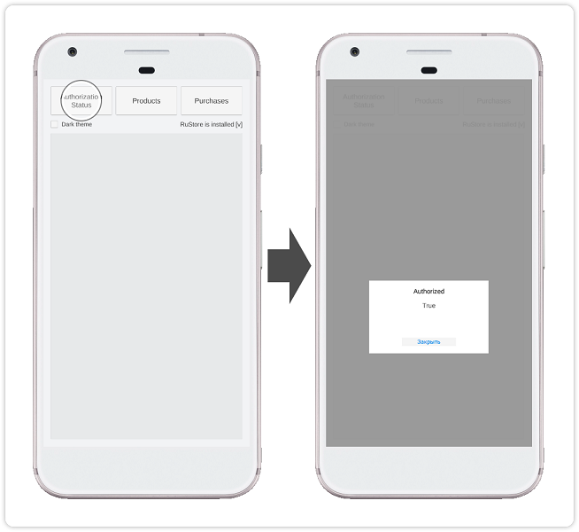
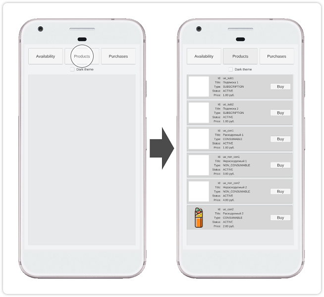
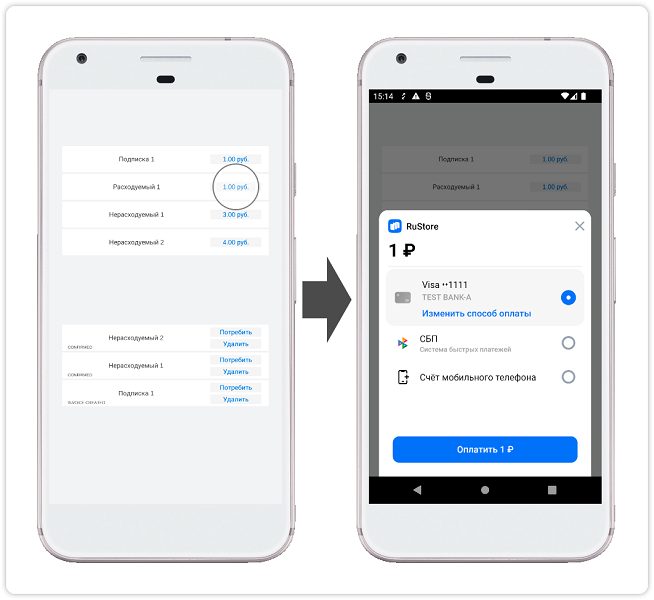

<!-- ── Language switch (EN active) ──────────────────────────────────── -->

  
    [RU][ru]
  
    EN
  

<!-- ────────────────────────────────────────────────────────────────── -->

> ⚠️ Do not use the "Code → Download" button on the GitFlic website – this method does not download files from Git LFS. [Cloning instructions](../README_CLONE.md).

### Unity plugin for RuStore to accept payments through third-party applications

#### [🔗 Developer documentation][10]

#### SDK requirements

To use the payment processing SDK, the following conditions must be met:

- The user and application must not be blocked in RuStore.
- In-app purchases must be enabled in [RuStore Console](https://console.rustore.ru/).

> ⚠️ The service has restrictions when operating outside of Russia.

Unity versions 6000+ are supported.

#### Preparing required parameters

Before setting up the example app, prepare the following data:

- `applicationId` — unique Android application identifier in reverse domain name format (example: `ru.rustore.sdk.example`).
- `*.keystore` — keystore file used for [signing and authenticating Android apps](https://www.rustore.ru/help/developers/publishing-and-verifying-apps/app-publication/apk-signature/).
- `consoleApplicationId` — application ID from RuStore developer console (example: `https://console.rustore.ru/apps/123456`, `consoleApplicationId` = `123456`). Detailed information about publishing apps in RuStore is available in the [RuStore documentation](https://help.rustore.ru/rustore/for_developers/publishing_and_verifying_apps).
- `productIds` — [subscriptions](https://www.rustore.ru/help/developers/monetization/create-app-subscription/) and [one-time purchases](https://www.rustore.ru/help/developers/monetization/create-paid-product-in-application/) available in your app.
- `deeplinkScheme` — URL scheme for deep links. Any unique name can be used (e.g., `example`).

#### Setting up the example app

To test the app functionality, you can use the [sandbox payments](https://www.rustore.ru/help/developers/monetization/sandbox) feature.

1. Open the **Unity** project from the `billing_example` folder.
1. Open the **BillingClientSampleScene** scene from the `Assets / RuStoreBillingExample / Scenes` folder.
1. Open **RuStore Billing SDK** settings (**Window → RuStoreSDK → Settings → BillingClient**).
1. In the **Console Application Id** field, specify the value of `consoleApplicationId` — the application ID from the RuStore developer console.
1. In the **Deeplink Scheme** field, specify the value of `deeplinkScheme` — the URL scheme for deep links.
1. Open the **BillingClientSampleScene**, and in the **Product Ids** list (object **ExampleController → Example Controller (Script)**), list the [subscriptions](https://www.rustore.ru/help/developers/monetization/create-app-subscription/) and [one-time purchases](https://www.rustore.ru/help/developers/monetization/create-paid-product-in-application/) available in your app.
1. In **Publishing Settings** (**Edit → Project Settings → Player → Android Settings**), select **Custom Keystore** and set the **Path / Password**, **Alias / Password** for the prepared `*.keystore` file.
1. In **Other Settings** (**Edit → Project Settings → Player → Android Settings**), configure the **Identification** section by checking **Override Default Package Name** and specifying `applicationId` in the **Package Name** field.
1. Build the project using the **Build** command (**File → Build Settings**) and verify the app functionality.

#### Usage scenario

##### Checking user authorization status

The initial screen of the app does not contain loaded data or notifications. Tapping the **Authorization Status** button performs an [authorization status check][20].

##### Retrieving product list

Tapping the **Products** button retrieves and displays the [list of products][30].

##### Purchasing a product

Tapping the **Buy** button initiates the [product purchase][40] flow with a payment method selection overlay.

#### Changelog

[CHANGELOG](../CHANGELOG.md)

#### Licensing Terms

This software, including source codes, binary libraries, and other files, is distributed under the MIT license. Licensing details are available in the [MIT-LICENSE](../MIT-LICENSE.txt) document.

#### Technical Support

Additional help and instructions are available in the [RuStore documentation](https://www.rustore.ru/help/en/) and via email at support@rustore.ru.

[10]: https://www.rustore.ru/help/en/sdk/payments/unity/10-5-0
[20]: https://www.rustore.ru/help/en/sdk/payments/unity/10-5-0#getauthorizationstatus
[30]: https://www.rustore.ru/help/en/sdk/payments/unity/10-5-0#getproducts
[40]: https://www.rustore.ru/help/en/sdk/payments/unity/10-5-0#purchaseproduct

[ru]: README.md
[en]: README.en.md
