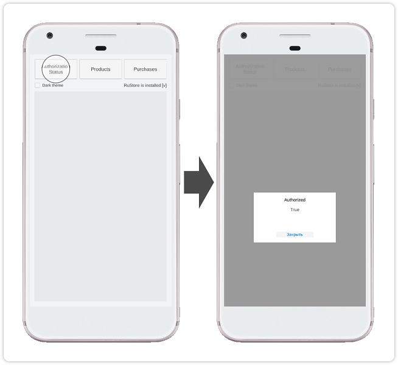
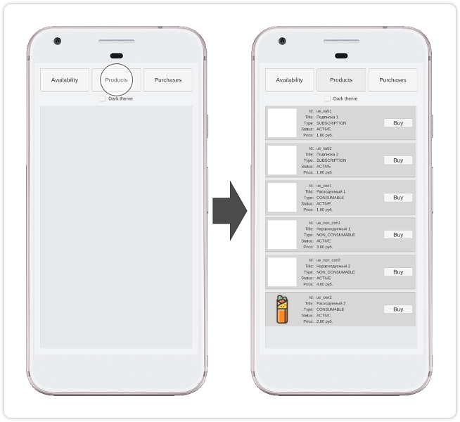
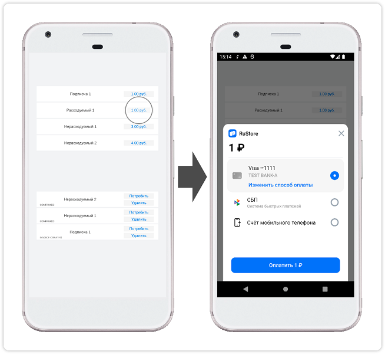

> ⚠️ Не используйте кнопку "Код → Скачать" на сайте GitFlic – этот метод не загружает файлы из Git LFS. [Инструкция по клонированию](../README_CLONE.md).

### Unity-плагин RuStore для приёма платежей через сторонние приложения

#### [🔗 Документация разработчика][10]

#### Условия работы SDK

Для работы SDK проведения платежей необходимо соблюдение следующих условий.

- Пользователь и приложение не должны быть заблокированы в RuStore.
- Для приложения включена возможность покупок в системе [RuStore Консоль](https://console.rustore.ru/).

> ⚠️ Сервис имеет ограничения на работу за пределами РФ.

Поддерживаются версии Unity 2022+.

#### Подготовка требуемых параметров

Перед настройкой примера приложения необходимо подготовить следующие данные.

- `applicationId` — уникальный идентификатор приложения в системе Android в формате обратного доменного имени (пример: `ru.rustore.sdk.example`).
- `*.keystore` — файл ключа, который используется для [подписи и аутентификации Android-приложения](https://www.rustore.ru/help/developers/publishing-and-verifying-apps/app-publication/apk-signature/).
- `consoleApplicationId` — код приложения из консоли разработчика RuStore (пример: `https://console.rustore.ru/apps/123456`, `consoleApplicationId` = `123456`). Подробная информация о публикации приложений в RuStore доступна в [документации RuStore](https://help.rustore.ru/rustore/for_developers/publishing_and_verifying_apps).
- `productIds` — [подписки](https://www.rustore.ru/help/developers/monetization/create-app-subscription/) и [разовые покупки](https://www.rustore.ru/help/developers/monetization/create-paid-product-in-application/), доступные в вашем приложении.
- `deeplinkScheme` — URL-адрес для использования deeplink. В качестве названия может быть использовано любое уникальное имя (например: `example`).

#### Настройка примера приложения

Для проверки работы приложения вы можете воспользоваться функциональностью [тестовых платежей](https://www.rustore.ru/help/developers/monetization/sandbox).

1. Откройте проект **Unity** из папки `billing_example`.
1. Откройте настройки **RuStore Billing SDK** (**Window → RuStoreSDK → Settings → BillingClient**).
1. В поле **Console Application Id** укажите значение `consoleApplicationId` — код приложения из консоли разработчика RuStore.
1. В поле **Deeplink Scheme** укажите значение `deeplinkScheme` — URL-адрес для использования deeplink.
1. Откройте сцену **BillingClientSampleScene**, в списке **Product Ids** (объект **ExampleController → Example Controller (Script)**) перечислите [подписки](https://www.rustore.ru/help/developers/monetization/create-app-subscription/) и [разовые покупки](https://www.rustore.ru/help/developers/monetization/create-paid-product-in-application/), доступные в вашем приложении.
1. В разделе **Publishing Settings** (**Edit → Project Settings → Player → Android Settings**) выберите вариант **Custom Keystore** и задайте параметры **Path / Password**, **Alias / Password** подготовленного файла `*.keystore`.
1. В разделе **Other Settings** (**Edit → Project Settings → Player → Android Settings**) настройте раздел **Identification**, отметив опцию **Override Default Package Name** и указав `applicationId` в поле **Package Name**.
1. Выполните сборку проекта командой **Build** (**File → Build Settings**) и проверьте работу приложения.

#### Сценарий использования

##### Проверка статуса авторизации у пользователя

Начальный экран приложения не содержит загруженных данных и уведомлений. Тап по кнопке **Authorization Status** выполняет [проверку статуса авторизации][20].

##### Получение списка продуктов

Тап по кнопке **Products** выполняет получение и отображение [списка продуктов][30].

##### Покупка продукта

Тап по кнопке **Buy** выполняет запуск сценария [покупки продукта][40] с отображением шторки выбора метода оплаты.

#### История изменений

[CHANGELOG](../CHANGELOG.md)

#### Условия распространения

Данное программное обеспечение, включая исходные коды, бинарные библиотеки и другие файлы, распространяется под лицензией MIT. Информация о лицензировании доступна в документе [MIT-LICENSE](../MIT-LICENSE.txt).

#### Техническая поддержка

Дополнительная помощь и инструкции доступны в [документациии RuStore](https://www.rustore.ru/help/) и по электронной почте support@rustore.ru.

[10]: https://www.rustore.ru/help/sdk/payments/unity/9-1-0
[20]: https://www.rustore.ru/help/sdk/payments/unity/9-1-0#getauthorizationstatus
[30]: https://www.rustore.ru/help/sdk/payments/unity/9-1-0#getproducts
[40]: https://www.rustore.ru/help/sdk/payments/unity/9-1-0#purchaseproduct
