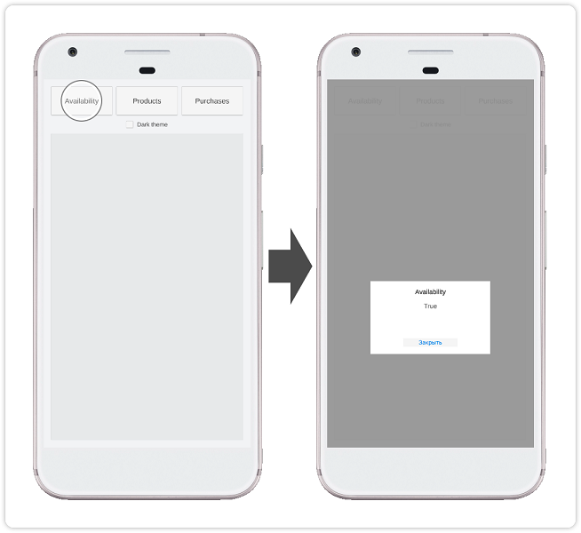
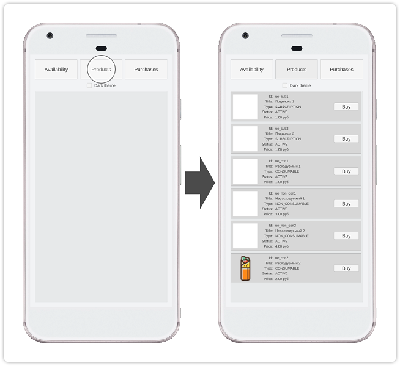
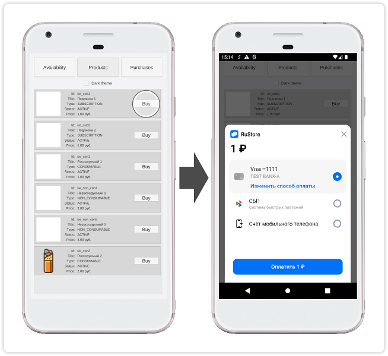

## RuStore Defold плагин для оценок и отзывов

### [🔗 Документация разработчика](https://www.rustore.ru/help/sdk/payments/unity)

- [Условия работы SDK](#Условия-работы-SDK)
- [Подготовка требуемых параметров](#Подготовка-требуемых-параметров)
- [Настройка примера приложения](#Настройка-примера-приложения)
- [Сценарий использования](#Сценарий-использования)
- [Условия распространения](#Условия-распространения)
- [Техническая поддержка](#Техническая-поддержка)

### Условия работы SDK

Для работы SDK проведения платежей необходимо соблюдение следующих условий:

1. На устройстве пользователя установлено приложение RuStore.

2. Пользователь авторизован в приложении RuStore.

3. Пользователь и приложение не должны быть заблокированы в RuStore.

4. Для приложения включена возможность покупок в системе [RuStore Консоль](https://console.rustore.ru/).

> ⚠️ Сервис имеет ограничения на работу за пределами РФ.

### Подготовка требуемых параметров

1. `applicationId` — уникальный идентификатор приложения в системе Android в формате обратного доменного имени (пример: ru.rustore.sdk.example).

2. `*.keystore` — файл ключа, который используется для [подписи и аутентификации Android приложения](https://www.rustore.ru/help/developers/publishing-and-verifying-apps/app-publication/apk-signature/).

3. `consoleApplicationId` — код приложения из консоли разработчика RuStore (пример: https://console.rustore.ru/apps/123456, `consoleApplicationId` = 123456). Подробная информация о публикации приложений в RuStore доступна на странице [help](https://help.rustore.ru/rustore/for_developers/publishing_and_verifying_apps).

4. `productIds` — [подписки](https://www.rustore.ru/help/developers/monetization/create-app-subscription/) и [разовые покупки](https://www.rustore.ru/help/developers/monetization/create-paid-product-in-application/) доступные в вашем приложении.

5. `deeplinkScheme` — URL-адрес для использования deeplink. В качестве названия может быть использовано любое уникальное имя (пример: yourappscheme).

### Настройка примера приложения

Для проверки работы приложения вы можете воспользоваться функционалом [тестовых платежей](https://www.rustore.ru/help/developers/monetization/sandbox).

1. Откройте проект Unity из папки _“billing_example”_.

2. Откройте настройки RuStore Billing SDK: Window → RuStoreSDK → Settings → BillingClient.

3. В поле _“Console Application Id”_ укажите значение `consoleApplicationId` — код приложения из консоли разработчика RuStore.

4. В поле _“Deeplink Scheme”_ укажите значение `deeplinkScheme` — URL-адрес для использования deeplink.

5. Откройте сцену _“BillingClientSampleScene”_ в списке Product Ids: объект _“ExampleController”_ → Example Controller (Script) перечислите [подписки](https://www.rustore.ru/help/developers/monetization/create-app-subscription/) и [разовые покупки](https://www.rustore.ru/help/developers/monetization/create-paid-product-in-application/) доступные в вашем приложении.

	> ⚠️ Количество объектов в списках _“Product Ids”_, _“Product Views”_, _“Purchase Views”_ должно совпадать.

6. В разделе Publishing Settings: Edit → Project Settings → Player → Android Settings выберите вариант _“Custom Keystore”_ и задайте параметры “Path / Password”, “Alias / Password” подготовленного файла `*.keystore`.

7. В разделе Other Settings: Edit → Project Settings → Player → Android Settings настройте раздел “Identification”, отметив опцию “Override Default Package Name” и указав `applicationId` в поле “Package Name”.

8. Выполните сборку проекта командой Build: File → Build Settings и проверьте работу приложения.

### Настройка примера приложения

Для проверки работы приложения вы можете воспользоваться функционалом [тестовых платежей](https://www.rustore.ru/help/developers/monetization/sandbox).

1. Выполните шаги раздела [“Сборка плагина”](../README.md). Собранные файлы (.jar) будут автоматически скопированы в проект-пример.

2. Откройте проект _“game.project”_ из папки _“billing_example”_.

3. В файле _“billing_example / main / main.script”_ в параметре "APPLICATION_ID" укажите код приложения из консоли разработчика RuStore. Пример: адрес страницы приложения https://console.rustore.ru/apps/123456, код приложения - 123456.

4. В файле _“billing_example / main / main.script”_ в параметре "DEEPLINK_SCHEME" укажите URL-адрес для использования deeplink. В качестве названия может быть использовано любое уникальное имя. Пример: example.

5. В файле _“billing_example / main / main.script”_ в параметре "PRODUCT_IDS" перечислите [подписки](https://www.rustore.ru/help/developers/monetization/create-app-subscription/) и [разовые покупки](https://www.rustore.ru/help/developers/monetization/create-paid-product-in-application/) доступные в вашем приложении.

6. В файле _“billing_example / extension_rustore_billing / manifests / android / AndroidManifest.xml”_ в параметре "data android:scheme" укажите URL-адрес для использования deeplink (должен совпадать с параметром DEEPLINK_SCHEME из пункта 3).

7. В меню "Bundle Application" (Project → Bundle → Android Application...) выполните настройку параметров "Keystore", "Keystore Password", "Key Password".

8. Выполните сборку проекта командой “Create Bundle...” (Project → Bundle → Android Application... → Create Bundle...) и проверьте работу приложения.

### Сценарий использования

#### Проверка доступности работы с платежами

Начальный экран приложения не содержит загруженных данных и уведомлений. Тап по кнопке `Availability` выполняет [проверку доступности платежей](https://www.rustore.ru/help/sdk/payments/checkpurchasesavailability).

#### Получение списка продуктов

Тап по кнопке `Products` выполняет получение и отображение [списка продуктов](https://www.rustore.ru/help/sdk/payments/getproducts).

#### Покупка продукта

Тап по кнопке `Buy` выполняет запуск сценария [покупки продукта](https://www.rustore.ru/help/sdk/payments/purchaseproduct) с отображением шторки выбора метода оплаты.

### Условия распространения

Данное программное обеспечение, включая исходные коды, бинарные библиотеки и другие файлы распространяется под лицензией MIT. Информация о лицензировании доступна в документе [MIT-LICENSE](../MIT-LICENSE.txt).

### Техническая поддержка

Дополнительная помощь и инструкции доступны на странице [rustore.ru/help/](https://www.rustore.ru/help/) и по электронной почте [support@rustore.ru](mailto:support@rustore.ru).
